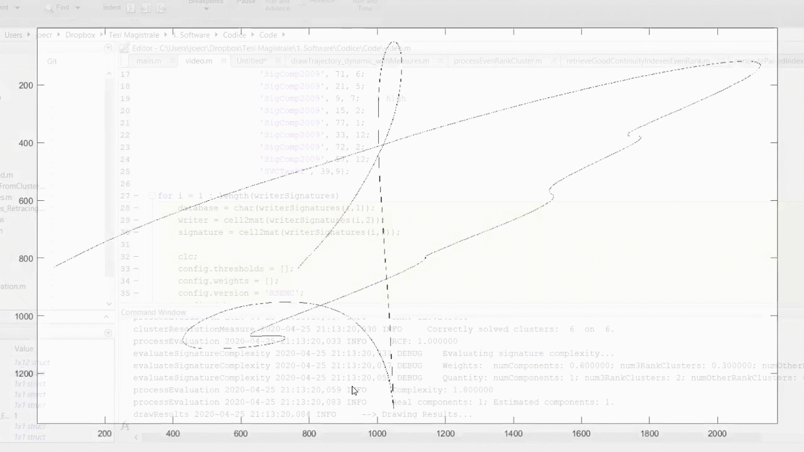

# Writing Order Recovery in Complex and Long Static Handwriting

**cite** contains a MATLAB implementation for our [paper](https://www.researchgate.net/publication/349988795_Writing_Order_Recovery_in_Complex_and_Long_Static_Handwriting).  
If you find this code useful in your research, please consider citing:

```
    @article{diaz2021wor,
      title={Writing Order Recovery in Complex and Long Static Handwriting},
      author={Diaz, Moises and Crispo, Gioele and Parziale, Antonio and Marcelli, Angelo and Ferrer, Miguel A.},  
      journal={International Journal of Interactive Multimedia and Artificial Intelligence},
      volume={X},
      number={X},
      pages={1--14},
      year={2021},
      publisher={UNIR},
      doi = {To appear}
    }
```

1. [Installation](#installation)
2. [Run the code](#run-the-code)
3. [Demo](#demo)


## Installation
Clone the code on you local machine and run `src/main.m` script.

### Requirements
You must have Matlab version 2016.a or major to run this code


## Run the code
The main function is composed of 8 parts, as shown below:
1. [Algorithm Threshold and options configuration](#algorithm-threshold-and-options-configuration)
2. [Data Fetching](#data-fetching)
3. [Point Classification](#point-classification)
4. [Local Examination](#local-examination)
5. [Global Recostruction](#global-reconstruction)
6. [Results and evaluation computation](#results-and-evaluation-computation)
7. [Drawing](#drawing)
8. [Environment cleaning](#environment-cleaning)


```matlab
%% OPTIONS INITIALIZATION
% - Algorithm thresholds and weights initialization
options = configuration(config);

%% DATA LOADING AND INITIALIZATION 
% - Image reading and data loading
[data, options] = loadData(options);

%% POINT CLASSIFICATION
% - Image analysis, point classification and cluster detection
[image, clusters] = pointClassification(data, options);

%% LOCAL EXAMINATION
% - Skeleton correction and cluster processing
[image, clusters] = localExamination(image, clusters, options);

%% GLOBAL RECONSTRUCTION
% - Initial point detection and trace following
unfolder = globalReconstruction(image, clusters, data, options);

%% COMPUTING RESULTS
% - Process evaluation and drawing unfolded trace
results = worEvaluation(image, clusters, unfolder, data, options);

%% DRAWING RESULTS
% - Drawing unfolded trace, components
drawSignatureResults(image, clusters, unfolder, data, options, results);

%% CLEARING ENVIRONMENT
% - Clearing data, options, unfolder and so on
cleanEnvironment(image, data, clusters, unfolder, options);
```

### Algorithm Threshold and options configuration
In this section, the threshold and the weights used in the algorithm decisional part are defined. For more information see the paper attached.
Also, the code options for logging, debug and execution are defined.

**Code options**
- options.debug: if you want to execute with debug code;
- options.plot: if you want to plot some auxiliar figures;
- options.real: if you want to do the algorithm also on the real specimen version (you need a skeletonization specimen)  
- options.computeResults: if you want to compute the metrics (you need the online version of the speciment)

For the execution, we could choose for different strategies: 
- ESTNC: Estimed Starting Points Nearest Criteria -> we estimate the components starting points and we choose the next through the Nearest Criteria (by taking the end point with the minimum distance).
- RSENC: Real Starting/Ending Point Nearest Criteria -> we take the starting/ending points location from the real reference (the 8connected version) and we choose the next through the Nearest Criteria (by taking the end point with the minimum distance). **You need the online version of the specimen.**
- RSEOC: Real Starting Point Ordered Criteria -> we take the starting/ending points location from the real reference(the 8connected version) and we choose the next by looking at the reference (we have an ordered set of starting points). **You need the online version of the specimen.**
- ALL: all the previous strategies, together. **You need the online version of the specimen.**

### Data Fetching

### Point Classification

### Local Examination

### Global Reconstruction

### Results and evaluation computation

### Drawing

### Environment Cleaning 


## Demo

See the full video <a href="https://www.youtube.com/watch?v=TYoZZ8CThhw" target="_black">here</a>. 

**High complexity**


**Medium complexity**


**Low complexity**

